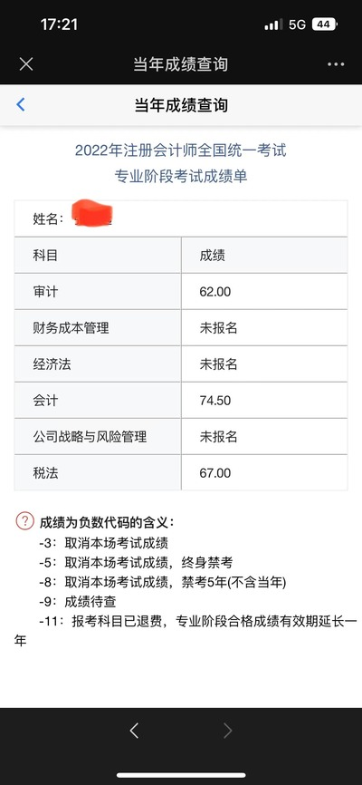
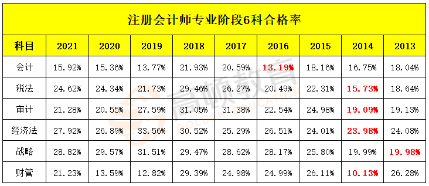
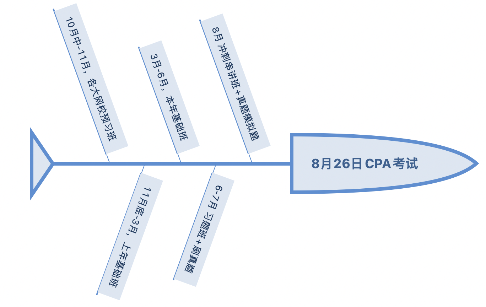
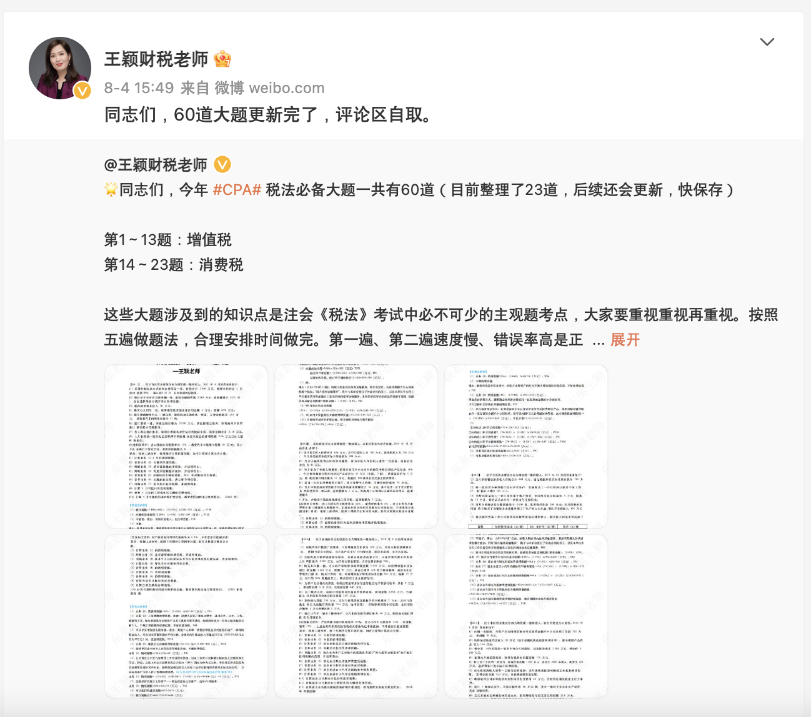

# 32岁的我是如何零基础在职一年通过3科CPA考试的

今年CPA的考试成绩已经在11月21日早上10点多的时候出了，最终成绩跟我预想的不太一样，但是我报考的会计、审计和税法都顺利通过了，撒花~~

<!-- truncate -->

> 本来以为我的审计学的特别好，80分没问题，结果才62。
> 
> 本来以为我的税法学的特别差，可能过不了，但是居然67，所以最终这个成绩也是让我十分迷惑。

既然2022考季结束了，我希望可以通过本篇文章对今年的考试做一个总结，并对2023考季进行一个展望，如果能帮助到你那就更好了。

## 关于我

首先我想聊一下我考试之前的基本情况，32岁，0基础非专业（程序员），在职，2娃奶爸，工作不忙。

1. 关于基础：在准备CPA考试之前，我对这个财务的了解仅限于可以找他们去贴发票报销差旅费，除此之外一概不知，更别说借贷记账法这种高级货了。
2. 我的职业：我是一个目前在事业单位就职的程序员，曾经也是国内某大厂打工人，但是由于加班太多身体不适，选择了工资低压力小的事业单位。
3. 为什么选择考：去年10月份我看了本《巴菲特传》，觉得很有趣，收获就是巴菲特和芒格都在说，你想赚钱，如果连会计都不懂怎么赚钱呢？遂找了一本世界上最简单的会计书入门，看完之后感觉意犹未尽，便有了通过考CPA以考促学的想法。

4. 我的年龄：虽然不想暴露，考前32岁，就算一科不挂顺利拿证，我也到了程序员下岗年龄35岁了。我也知道这个年纪考了CPA在职业上可能没啥用，不过疫情这么严重，不看书学习还能干啥呢？

## 关于备考
### 如何选科目

CPA考试6科分专业阶段和综合阶段，专业阶段共6科，把科目学习难度、复习时间和通过率一起考虑，个人认为的综合排序（越难考越靠前）：《会计》=《财务成本管理》>《审计》>《税法》>《经济法》=《公司战略与风险管理》
> 中注协公布的各科专业阶段通过率，大家在网上也可以找到各大网校的总结版本。

有了难度排序，我个人的建议是：**把难考的放在前面！** 为什么我要这么选，相信很多人都会想拿经济法和战略来试水CPA，然后考过了之后逐步建立的自信心。这样选可能适合一些人，但是通过跟很多人交流，会发现有些人就是学不懂财管或者学不懂审计，最终导致5年之后成绩过期，遗憾放弃。
所以从效率的角度出发，我建议把自己认为最难的放在最前面考，因为第一年一般是冲劲最大的一年，如果能一次性冲过自己的障碍，会极大增强自己的自信心，那么后续的考试自然是水到渠成。如果实在没有办法考过，浪费一年也比浪费5年好得多。
如果你的情况跟我类似，也希望可以在职通过cpa，那么我的建议考试组合如下：

1. 3科流
   1. 第一年会计+审计+税法，第二年财管+经济法+战略，我的组合，数学对我来说不是个难题，但是会计和审计对我来说是空白，所以我选了这种组合，可以顺路刷掉税务师的税一+税二。
   2. 第一年会计+财管+经济法，第二年审计+税法+战略，第一年与中级会计师考试内容相同且考试时间接近，考完CPA马上去考中级，一年内直接有收获，但是第二年的三科没有太多关联性，考起来会有一种割裂感。
2. 2科流，第一年会计+审计，第二年财管+经济法，第三年税法+战略，会计审计关联性强，第二年考完直接去裸刷中级和税务师的涉税相关法律+财务与会计也很舒服，第三年洒洒水就过了。如果是我，2科流这是我建议的唯一方案，考试过程会让你有一种水到渠成的感觉，非常舒适。
### 时间安排

如果你跟我一样0基础，是一个甚至连借贷都搞不懂的小白（我估计这篇文章的读者没有比我更菜的了），我的时间安排或许有一点参考价值。

上面是2022考季，我复习的主要经历

1. 2021年10月中旬-11月，每天大概一两个小时左右，走马观花一样看完了预习班
2. 11月底-2022年3月，一路看完了2021年的基础班，有些章节做了题，有些章节没有（这是我认为我最失败的地方）
3. 3月-6月，跟着新的网课刷完基础班，完成课后章节的习题，直到这个时候才开始对CPA考试有一些感觉了
4. 6月-7月，习题班，大量做习题，把书逐步学薄。这里我大量的在刷真题，直到把历年真题做到95分以上。
5. 8月-考前，听一下各种老师的串讲班，把书读的更薄，并查漏补缺，可以做一些模拟题，但不要被模拟题的分数影响心态，绝大多数模拟题**非常糟糕**，跟真题的考察点完全不一致，甚至不少不专业的网校给出的答案都有问题，还是以真题为主。

我的反思

1. 因为我啥也不会，所以只能笨鸟先飞，用大量的时间来弥补我很多基础知识的缺失。比如我用了很长时间才搞懂借贷记账法是怎么回事。
2. 我太过急于基础班的进度，忽略了每一章学习的质量，导致我第二遍再刷2022年基础班的过程感觉每个点我都没听过，会有灰心丧气的感觉。2023年我不会刻意追赶进度，而是去追求扎实的学完每一章每一个知识点，有的时候慢就是快，如果设计合理，可以额外节省出1-2个月时间。

### 科目备考经验

在这里我只聊聊我考过科目的感受，如果明年全过了，我会把所有科目完善出来。

#### 会计

一个可以把会计学好的人，一定可以当一个优秀的程序员。没学之前，我可能不会把这两个学科放在一起，但是学了之后发现，其实会计是一个非常具有逻辑和结构化的学科，每一个会计分录就像程序的一条条指令一样，是结构非常鲜明的。

大家觉得最难学的长期股权投资以及合并财务报表，其实不过就是一个个不同的模板而已，在你理解他背后的逻辑之后，照着模板写就是水到渠成。

比如最复杂的权益法核算的长期股权投资，目的就是让财务报表使用者了解如果我有一个重大影响的子公司，那么子公司详细的增减变动是如何处理的。那么权益法下面的四个女朋友：投资成本（怎么买的）、损益调整（子公司的经营状况+股权投资）、其他综合收益（子公司的权益投资）、其他权益变动（跟其他股东在battle股权导致的变化），关注好这四个要点，每个阶段无非就是在做这四件事而已，这样我们把每件事拆解细了之后，在单独理解比如投资成本的初始计量是我们花钱买了股权，我们不控制这个企业，就没有商誉，如果花的钱比市场价小，我们买赚了就计营业外收入，如果花钱花多了，就当冤大头，该记多少就记多少就是了。

再比如为什么我们达到控制的长期股权投资只需要用成本法核算，那是因为有达到控制的子公司之后，我们在编合并报表时会把子公司的报表拿过来直接放在合并报表中，母公司单独报表中的长投改来改去的意义也不大，反正也没几个人看，就懒得改了。

还有，为什么投资性房地产从成本模式转换为公允价值模式的时候，公允价值大于成本时要计入其他综合收益，其他转换都计入公允价值变动损益。如果都放在公允价值变动损益中，有上市公司本身可能亏损了，到年底CEO大笔一挥，改一下会计政策，立马从亏损变盈利，然后大吹特吹一波，把股东割韭菜。所以准则规定，超出的部分要计入其他综合收益，不影响损益，防止上市公司管理层操纵利润。

从准则背后的原理出发，如果是让你去中注协设计准则，你也会这么设计。

讲到这里，我认为的会计学法，首先搞懂主要原理，然后把分录当模板去刷，就很容易通过了。如果你觉得学的还是很困难，也欢迎你来找我进一步沟通，吹水也欢迎。

另外值得一提的是，**会计的知识面覆盖一定要全面**，才可能通过，比如我觉得租赁太难了，我不想学了，赌一把我运气好今年不考，反正我看真题上也不是年年都有，对吧。

这里我想说的是，如果你有这种想法，大概率你的会计可能考58/59，遗憾不过，因为我们在市面上能看到的5年真题的数量远低于实际CPA考试的真题数量。这里有很多人很奇怪，不是都会出版吗？事实上每年CPA考试都有多套试卷，尤其是这两年有延期考试的同学，就导致了会计这一科每年至少会有8套试卷，每套的考核点都不同，但基本会把会计30章的内容都覆盖完。**所以你看到的历年真题，并不是真正完整版的历年真题！** 不要认为有些内容可能不会考，实际上是不仅所有内容都考，而且年年考！

#### 审计

大言不惭的说，我曾经以为我的审计学的特别好，没有80也应该随便70多分，结果让我大跌眼镜才62分。

也许我也没弄懂到底是哪里存在问题，不过赖好也是过了，就说一下我的经验。

审计在很多人眼里可能有不少抽象的概念，但其实绕来绕去也就在前6章有，前6章搞明白了，中间就是对前6章概念的应用。最后三章关于职业道德、独立性和质量管理体系，对于绝大多数人来说，用你朴素的价值观+通读几遍知识要点，都能答个七七八八。

所以对于审计来说，我认为最重要的就是刷真题，不要去刷模拟题，把历年真题做5遍以上，几十分钟刷完一套，一天可以刷3-4套的程度，会基本上把绝大多数知识点覆盖完，对于考过审计个人认为是足够了。

额外值得一说的是，审计的综合题是我认为CPA考试里最好玩的题，也是我最喜欢做的题，如果你会计学的还行，就有一种玩大家来找茬时候你马上就能找到的那种快感。常考核的点基本都在收入确认、政府补助的确认、持有待售类别等地方。

还有同学会抱着审计的知识点一阵狂背，会觉得背书很痛苦。讲真审计从开始学到考试，我一个知识点也没特意背过，都是在刷真题的过程中，写多了就记住了，没有必要额外背。

#### 税法

税法是我最讨厌的一科，又碎又乱，每次看题都有你没遇到过的知识点，税收优惠茫茫多，我甚至在考后陷入了税法恐惧症，一眼都不想再看税法了，但是结果反倒不是很差。

对于税法来说，我的建议是多做题，甚至可以采用题海战术。为什么这么说，比如我列下面10条房产税的税收优惠，看看你能记住几条：

1. 个人的非营业房产
2. 按规定价格出租的公有住房和廉租住房暂免
3. 经营公租房的租金免税，兼营非免税项目的要单独核算，否则无法优惠
4. 企业办学校、医院、托儿所、幼儿园自用的房产
5. 经鉴定的毁损房和危房（已停止使用）
6. 房屋大修连续停用半年以上，大修期间免税
7. 施工期间工地的临时房屋
8. 纳税单位与免税单位公用的，按使用部分分别纳税或免税
9. 文化事业单位转企业的，5年内自用房产免税
10. 用于社区养老托与家政服务的房产。

很具体对吧，而且每一条都可能是一个选择题，甚至两个，人们对自己犯下的错误通常印象深刻，所以我建议多做做选择题，不要怕做错，把错题好好整理一下，考前多翻翻。

大题部分，我去年用了刘颖老师的《60道大题》，是免费的，大家可以到她的微博下面去找，预计明年也会出，刷够5遍，基本上大题应该就不会有太大问题了。

### 网课

关于网课，看不看，怎么看，看多少，每个人的理解都不同，我的想法：

1. 预习班如果有经验可以不看，看完也记不住个啥
2. 基础班要认真学习，结合教辅材料做课后习题，基本上一个月一科
3. 如果把习题班里面的题都弄懂，应付考试其实是足够了的，一个月3科
4. 串讲班帮你查漏补缺，把书读薄，一周内

入不入正？这个问题其实比较敏感，我第一年没有入正，我也考过了，但是第二年我入了，说下理由：

1. D版的更新速度有问题，五一的时候停更了，我着急看，每天都问老板啥时候更，老板一直没理我，等到五一假期结束了，回了我一句五一他们放假了，给我气的吐血，耽误了好几天时间。
2. 效率问题，正版不只是视频课程那么简单，还有配套题库，别小看网上的配套题库，自动记录下来错题，一键重新打开新的题会极大提升你的效率。有人会说那种小网校的题库也挺好的，那个多便宜。我也买了，被错误答案坑了几次之后果断放弃。

所以入正不入正都不影响你能不能考得过，个人感觉只是花点钱可能让我省下一两个月时间，这是我今年入正的理由。

### 一些小技巧

1. 复习过程中，能用电脑打字的，坚决不用笔写。可能由于我是程序员，我觉得书写的效率是极低的，虽然很old school。我用电脑打字，可能刷了3套题了，用笔写可能一套都没刷完，这非常影响效率。而且现在都是机考了，没必要去练写字的手速。
2. 多练练搜狗输入法V模式，熟练掌握V模式让我基本上每门考试都差不多用了一半时间就把所有题都写完了，检查一遍，然后潇洒离场顺利通过考试。
3. 有些笔记类的思维导图价值很大，我用的《椰子cpa》，到后期可以帮助你每天把整本书的知识点覆盖一遍，对于整体思考非常有帮助，甚至考前那一两个小时的时候你拿着多扫几遍，没准就帮你收获几分（今年税法的拍卖祖传传家宝的个人所得税税率，就是我在考前5分钟扫这个资料看到的）。
4. 模拟题基本上除了会搞心态，其他一无是处，有人出的很难，有人出的很简单，做的好或者不好都有可能被搞心态。所以我不建议做任何模拟题，把真题里的知识点都搞透彻，基本上真题再做不错，把知识点多听听足以顺利通过考试。
5. 复习的过程枯燥又乏味，坚持不住，没毅力怎么办？我个人觉得，毅力是一个非常糟糕且反人类的东西，没有人会一直坚持着自己不喜欢的事情，那除了痛苦就是痛苦。如果没法静下心来学习，那么我建议给自己定一个先学10分钟的目标，然后逐步增加到20分钟，一个小时，3个小时，5个小时，甚至10个小时。先定一个可以完成的小目标，再逐步扩大，**单纯享受求知的快乐。**
6. **不要熬夜，不要熬夜，不要熬夜**，重要的事情说三遍。有人说我工作很忙，晚上回家带娃，我老公管不了孩子，11点开始才能学习，我学到2-3点，第二天还得上班，我要死了，但是我没办法我只能这样。我只能说人生就是取舍，你不能什么都想要，上班的时候能摸鱼摸鱼，工作是老板的，只有CPA是你自己的。熬夜学习只会增加你的猝死风险、会让你变得更胖，干不好工作，精神更丧，提高你考不过的概率。
7. 不要相信任何包过短信，全是骗子。
8. 找一个一起考试的圈子，不要单打独斗，互相鼓励会让你的生活没那么枯燥。
9. 如果你觉得很累，学不动了，扔下当前的学习出去转一圈玩一会，会让你效率更高。
10. CPA是一个通过性考试，不是选拔性考试，把基础知识点掌握全面且牢固是最重要的，把不该错的不做错，不要去看那些歪偏怪的题，得到60分通过考试足矣。

### 我的收获

1. 考完3科之后，我也算半个注册会计师了，掌握了不少新知识。
2. 原来坚持下来的自己这么厉害。
3. 明年我应该会采用更有效率的方式，把复习时间压缩掉2个月，取得更高的分数，争取一科不挂通过一次性通过专业阶段。
